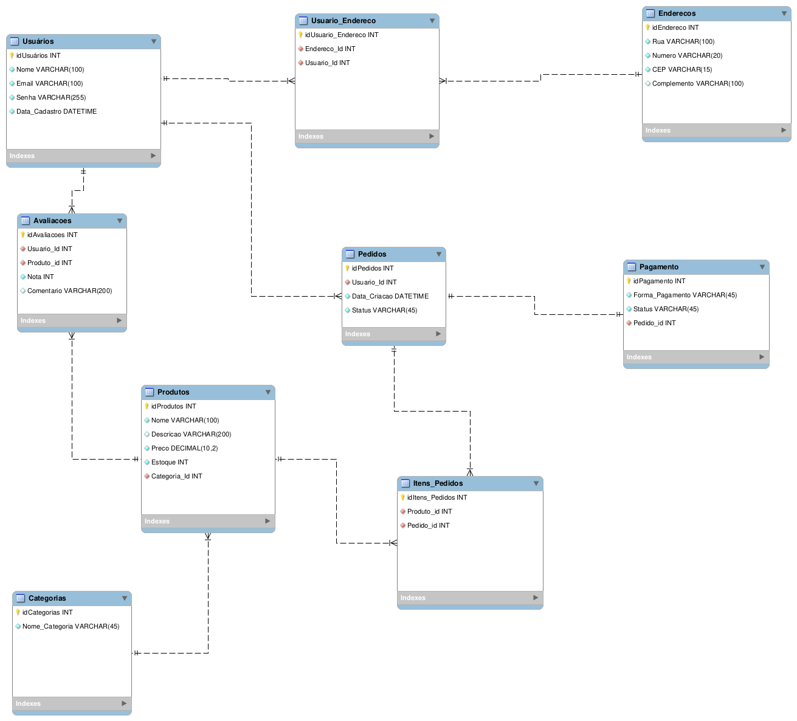

### DOCUMENTAÇÃO
# **Sistemas de Vendas Online**
---------------
# Sumário

  - [Glossário de siglas](#glossário-de-siglas)
  - [Objetivo](#objetivo)
  - [Regras de Negócio e Análise de requisitos](#regras-de-negócio-e-análise-de-requisitos)
  - [Usuários](#usuários)
  - [Produtos](#produtos)
  - [Categorias](#categorias)
  - [Pedidos](#pedidos)
  - [Pagamentos](#pagamentos)
  - [Modelo Conceitual](#modelo-conceitual)
  - [Modelo Lógico](#modelo-lógico)

### **Glossário de siglas**
- **DDL:** Linguagem de Definição de Dados;
- **DML:** Linguagem de Manipulação de Dados;
- **DCL:** Linguagem de Controle de Dados;
- **DTL:** Linguagem de Transação de Dados;
- **DB:** Banco de Dados;
- **SGBD:** Sistema Gerenciador de Banco de Dados;
### **Objetivo**
Este projeto tem como finalidade a criação de uma arquitetura de um Banco de Dados Relacional, assim como, a construção e uso das quatro categorias de comandos SQL **(DDl, DML, DCL e TCL)**.

### **Regras de Negócio e Análise de requisitos**

Será construído um **DB** para um **Sistema de Vendas Online**

### **Usuários**
- Cada usuário tem um nome, email único, senha, e data de cadastro.
- Um usuário pode ter vários endereços cadastrados.
- Um usuário pode fazer vários pedidos.
- Um usuário pode avaliar produtos.

### **Produtos**
- Cada produto tem nome, descrição, preço, estoque, e pertence a uma categoria.
- Produtos podem receber avaliações feitas pelos usuários (nota de 1 a 5 e comentário).

### **Categorias**
- Cada categoria pode ter vários produtos.

### **Pedidos**
- Cada pedido pertence a 1 usuário e pode conter vários produtos.
- Cada produto do pedido tem quantidade e preço do momento da compra (caso o preço mude depois).
- Cada pedido tem uma data de criação e um status: pendente, pago, cancelado, enviado, entregue.

### **Pagamentos**
- Um pagamento pertence a 1 pedido.
- Um pagamento tem forma (boleto, cartao, pix) e status (pendente, aprovado, recusado).

## **Modelo Conceitual**
.png)

## **Modelo Lógico**
> **Observação:** O banco de dados foi criado, mesmo estando vazio, apenas para estruturarmos o modelo.
> Foi utilizado o SGBD MySQL por preferência e fins de aprendizado. No entanto, o MySQL também é uma opção bastante adequada para sistemas de vendas online, por ser amplamente utilizado no mercado.
> É excelente para onboarding, possui boa escalabilidade e atende bem a sistemas de médio e grande porte.
> **Outra opção para SGBD seria PostgreSQL**

Na criação do modelo lógico foi descoberto algumas questões que antes não tinham sido consideradas no modelo conceitual:
- Usúarios 1:N Endereços (usuarios possuem n endereços, endereços possuem apenas 1 usuário), o que pode não ser 
 interessante, pois a mesma regra serve para ambos, portanto, ajustamos a tabela no modelo lógico, tendo uma relação de N:M,
 foi implementada uma tabela associativa `Usuario_Endereco`;
